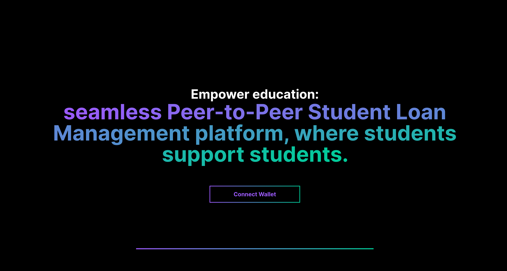
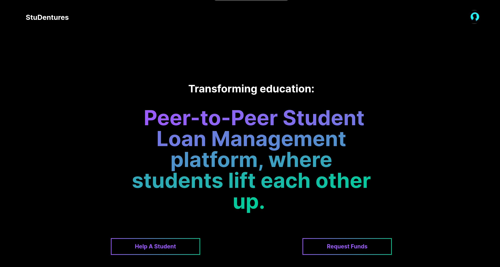

# **StuDentures**
Empower your education with Studentures: a student-driven crowdfunding platform where peers support peers in their academic and entrepreneurial journeys.

---
## Table of Contents

- [Introduction](#introduction)
- [Features](#features)
- [Screenshots](#screenshots)
- [Setup Instructions](#setup-instructions)

---

## Introduction

**StuDentures** is a student crowdfunding platform where students can request funds for their projects and needs. Other students and users can view these requests and contribute funds. The platform provides transparency by allowing users to see who has funded their requests. This project is built using Next.js and smart contracts deployed on the Sepolia Testnet.

---

## Features

- **Fund Requests**: Students can create and post fund requests with descriptions and required amounts.
- **Funding Contributions**: Users can view and contribute to fund requests.
- **Transparency**: Users can see the list of contributors for each fund request.
- **Blockchain Integration**: The project uses smart contracts deployed on the Sepolia Testnet for secure and transparent transactions.

---

## Screenshots

### Home Page



### Create Request


### Available Requests


### Fund Details


---

## Setup Instructions

To set up Studentures on your local system, follow these steps:

### Prerequisites

- [Node.js](https://nodejs.org/en/download/) (v14.x or later)
- [npm](https://www.npmjs.com/get-npm) or [yarn](https://yarnpkg.com/getting-started/install)
- [Git](https://git-scm.com/book/en/v2/Getting-Started-Installing-Git)

Clone the repository and follow the below procedures in the root directory of the project:

### Install Dependencies

```bash
npm install
```

### Export Environment Variables
Create a .env.local file in the root directory and add the following environment variables:
Replace your_infura_project_id and your_contract_address with your actual Infura project ID and the deployed contract address on the Sepolia Testnet.
```bash
NEXT_PUBLIC_INFURA_PROJECT_ID=your_infura_project_id
NEXT_PUBLIC_CONTRACT_ADDRESS=your_contract_address
```

### Build and Start the Server
```bash
npm run build
npm start
```

Alterantively, It can be started on a development server using:
```bash
npm run dev
```